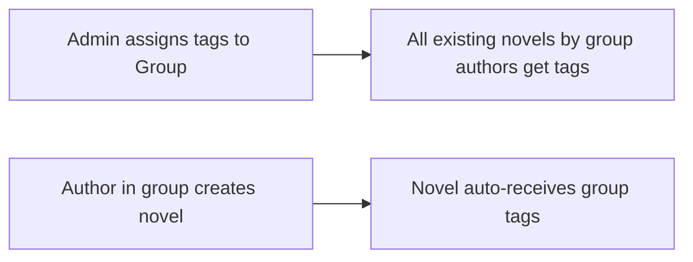

# Tag Management — Admin API

> Endpoints for managing tags and assigning them to editorial groups.
> Tags are system-managed labels automatically applied to novels via editorial groups — authors cannot add or remove them.
> All endpoints require `Authorization: Bearer {token}` and the user must have `role = admin`.

---

## How Tags Work



1. Admin creates tags (e.g. "Fantasy Team", "Priority Review")
2. Admin assigns tags to an editorial group via `PUT /api/admin/editorial-groups/{id}/tags`
3. All novels by authors in that group are automatically updated with those tags
4. When an author in a group creates a new novel, the group's tags are auto-attached

---

## Base URL

```
/api/admin/tags
```

---

## Endpoints

### 1. `GET /api/admin/tags`

List all tags with novel counts, ordered alphabetically.

**Response (200):**
```json
{
  "message": "All tags",
  "tags": [
    {
      "id": 1,
      "name": "Fantasy Team",
      "slug": "fantasy-team",
      "description": "Novels managed by the Fantasy editorial team",
      "color": "#3b82f6",
      "created_at": "2026-03-05T00:00:00.000000Z",
      "updated_at": "2026-03-05T00:00:00.000000Z",
      "novels_count": 8
    }
  ]
}
```

| Field          | Type   | Description                     |
|----------------|--------|---------------------------------|
| `id`           | int    | Tag ID                          |
| `name`         | string | Display name                    |
| `slug`         | string | URL-friendly slug               |
| `description`  | string | Tag description (nullable)      |
| `color`        | string | Hex color code (e.g. `#3b82f6`) |
| `novels_count` | int    | Number of novels with this tag  |

---

### 2. `POST /api/admin/tags`

Create a new tag.

**Request:**
```json
{
  "name": "Priority Review",
  "description": "Novels that need expedited review",
  "color": "#ef4444"
}
```

| Field         | Type   | Required | Validation                             |
|---------------|--------|----------|----------------------------------------|
| `name`        | string | ✅       | Max 255 chars, must be unique          |
| `description` | string | ❌       | Max 1000 chars                         |
| `color`       | string | ❌       | Hex color (`#RRGGBB`), default `#3b82f6` |

**Success (201):**
```json
{
  "message": "Tag created successfully",
  "tag": {
    "id": 2,
    "name": "Priority Review",
    "slug": "priority-review",
    "description": "Novels that need expedited review",
    "color": "#ef4444",
    "created_at": "2026-03-05T10:00:00.000000Z",
    "updated_at": "2026-03-05T10:00:00.000000Z",
    "novels_count": 0
  }
}
```

**Validation error (422):**
```json
{
  "message": "The given data was invalid.",
  "errors": {
    "name": ["The name has already been taken."]
  }
}
```

---

### 3. `GET /api/admin/tags/{tag}`

Get details of a single tag.

**Response (200):**
```json
{
  "message": "Tag details",
  "tag": {
    "id": 1,
    "name": "Fantasy Team",
    "slug": "fantasy-team",
    "description": "Novels managed by the Fantasy editorial team",
    "color": "#3b82f6",
    "created_at": "2026-03-05T00:00:00.000000Z",
    "updated_at": "2026-03-05T00:00:00.000000Z",
    "novels_count": 8
  }
}
```

---

### 4. `PUT /api/admin/tags/{tag}`

Update an existing tag. Only include the fields you want to change.

**Request:**
```json
{
  "name": "Fantasy Squad",
  "color": "#8b5cf6"
}
```

| Field         | Type   | Required | Validation                             |
|---------------|--------|----------|----------------------------------------|
| `name`        | string | ❌       | Max 255 chars, unique (excluding self) |
| `description` | string | ❌       | Max 1000 chars                         |
| `color`       | string | ❌       | Hex color (`#RRGGBB`)                  |

> [!NOTE]
> The `slug` is automatically regenerated when the `name` changes.

**Success (200):**
```json
{
  "message": "Tag updated successfully",
  "tag": {
    "id": 1,
    "name": "Fantasy Squad",
    "slug": "fantasy-squad",
    "...": "..."
  }
}
```

---

### 5. `DELETE /api/admin/tags/{tag}`

Delete a tag. **Blocked if attached to any novels.**

**Success (200):**
```json
{
  "message": "Tag 'Priority Review' deleted successfully"
}
```

**Has novels (409):**
```json
{
  "message": "Cannot delete tag 'Fantasy Team' because it is attached to novels. Remove it from all groups first.",
  "novels_count": 8
}
```

---

### 6. `PUT /api/admin/editorial-groups/{editorial_group}/tags`

Assign tags to an editorial group. This **replaces** the group's current tags and automatically syncs tags to all novels by authors in the group.

**Request:**
```json
{
  "tag_ids": [1, 3, 5]
}
```

| Field      | Type  | Required | Validation                         |
|------------|-------|----------|------------------------------------|
| `tag_ids`  | array | ✅       | Array of valid tag IDs             |

**Success (200):**
```json
{
  "message": "Tags synced to group 'Fantasy Team' and 12 novel(s) updated",
  "group_tags": [
    {
      "id": 1,
      "name": "Fantasy Team",
      "slug": "fantasy-team",
      "description": "...",
      "color": "#3b82f6"
    }
  ],
  "novels_synced": 12
}
```

> [!IMPORTANT]
> This endpoint syncs the group's tags **and** updates all novels by authors in the group. Tags from other groups are preserved — only this group's tags are replaced.

---

## Auto-Tagging Behavior

### On Novel Creation
When an author who belongs to an editorial group creates a novel, the group's tags are automatically attached. No action needed from the admin or author.

### On Group Tag Sync
When an admin calls `PUT /api/admin/editorial-groups/{id}/tags`:
- The group's tags are updated to match the provided `tag_ids`
- All novels by authors in the group are updated:
  - Old group tags are removed
  - New group tags are added
  - Tags from other groups are **not** affected

---

## Tags in Novel Responses

Tags appear in all novel API responses alongside genres:

```json
{
  "novel": {
    "id": 1,
    "title": "The Dragon's Return",
    "genres": [
      { "id": 1, "name": "Fantasy", "slug": "fantasy" }
    ],
    "tags": [
      { "id": 1, "name": "Fantasy Team", "slug": "fantasy-team", "color": "#3b82f6" }
    ]
  }
}
```

Affected endpoints:
- `GET /api/novels` (index)
- `GET /api/novels/{slug}` (show)
- `GET /api/novels/search`
- `GET /api/novels/popular`
- `GET /api/novels/latest`
- `GET /api/novels/recently-updated`
- `GET /api/novels/recommendations`
- `GET /api/novels/{slug}/related`
- `POST /api/novels` (store response)
- `PUT /api/novels/{slug}` (update response)
